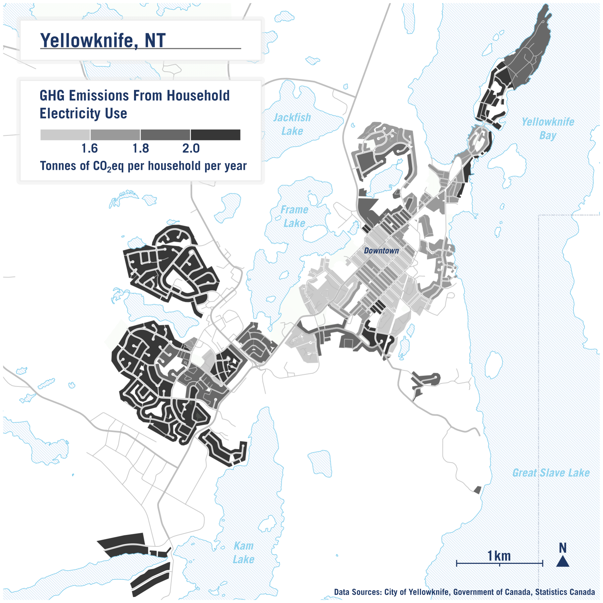
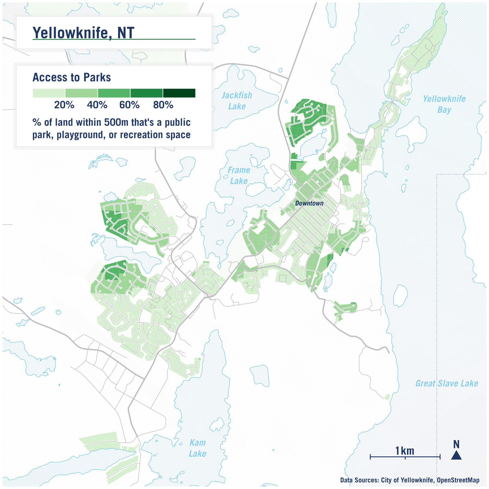

# Mapping Yellowknife

Urban data analytics and map-making are key tools in our understanding and planning of urban environments. They provide us with valuable insights into various phenomena such as land use, accessibility, environmental impacts, and sustainability—and how these vary across neighbourhoods. They can be crucial when making informed decisions in urban planning and policy-making.

Lots of urban research occurs in larger cities, like Toronto and Montréal, which typically have more data scientists, urban planners, and researchers within government and at research institutions who collect data and share research outputs, such as maps and public reports. In smaller cities, like Yellowknife, there’s less research attention—but this does not mean that there isn’t a need for similar work and outputs.

With guidance from [Rebecca Alty](https://schoolofcities.utoronto.ca/people/rebecca-alty/), the Mayor of Yellowknife and School of Cities Canadian Urban Leader, we created several maps of Yellowknife, each focused on a different urban issue. Yellowknife is the largest community and only city in the Northwest Territories, with a population of just over 20,000 (based on the 2021 census). Each map is designed to focus on the residentially-zoned areas of the city and is based on publicly-available data or data that most cities would likely have readily available, so that the data and methods would be relatively easy to reproduce in other contexts. The first two maps are about household carbon footprint, the third about fiscal productivity, and the final two on access to green space. Each map tells a specific story of the city of Yellowknife.

## Household CO₂ emissions

The first map shows how household Greenhouse Gas (GHG) impacts vary by neighbourhood – specifically, how much each household emits per year on average, by neighbourhood. We estimated this based on a combination of data sources: 1) average annual energy use by dwelling type 2) the carbon intensity of electricity in the Northwest Territories in CO₂eq and 3) the number of dwellings by type in each neighbourhood. A carbon dioxide equivalent (CO₂eq) is a metric used to compare emissions from various greenhouse gases based on their global-warming potential (GWP). It converts amounts of other gases to the equivalent amount of carbon dioxide with the same GWP.

The average emissions per household across all households is 1.8 tonnes of C0₂eq per year. However, the map shows a clear pattern of areas in and around the downtown having a smaller carbon footprint than the more peripheral suburbs. This is mainly a function of dwelling type. The larger a dwelling, the more energy is needed to heat and/or cool it, as well as the more electricity used to power appliances, lights, and other devices within the space. This is one piece of evidence on how smaller, denser housing is better for the environment.

## Commuting by car

One limitation with the map above is that it does not take into account transportation-related emissions. What is a household’s carbon footprint caused by how they travel on a day-to-day basis? Statistics Canada’s national census collects data at a neighbourhood level on travel mode to work. Travel to work is a good barometer of overall environmental impact of household transportation in an area. Overall, 73.5% of residents in Yellowknife who regularly travel to work do so by private vehicle, either as a driver or a passenger. Private vehicles, including cars, vans, and small trucks, emit significantly more greenhouse gases per traveler than public transit, cycling, or walking. The map below shows that propensity to drive varies quite a bit depending on the neighbourhood.

The patterns on this map clearly highlight how residents in the downtown area have a much lower propensity to drive compared to more suburban areas – likely because work destinations are closer and more accessible via other modes (e.g. walking). Neighbourhoods that have a mix of land-use in close proximity can lead to less distance travelled and fewer trips by car, and to reductions in emissions.

## Fiscal productivity

We next look at annual property tax for each parcel and divide it by its area in square metres. The map highlights how productive land is across the area in providing property tax revenue for the city. Like the other maps, we’re focusing solely on properties that are in areas zoned for residential uses (either solely or with multiple uses).

There’s a clear pattern of more central areas, typically those that are higher density residential or zoned for mixed uses, having greater property tax revenue per square metre.

Although not shown in this map, it’s typically the case as well that the more spread-out dwellings are, the more budget needs to be allocated to service each dwelling and maintain infrastructure on a per unit basis. (e.g. resurfacing a road that has 20 dwellings fronting it would cost practically the same as resurfacing a road of the same length with only 10 dwellings fronting it).

Overall, we find that denser mixed-use neighbourhoods are not only better in terms of climate impacts as shown in the maps above, but they are also more economically sound. Downtown Yellowknife performs particularly well when it comes to fiscal productivity, especially when compared to more suburban residential areas.

## Access to parks and nature

Outdoor public spaces, such as parks, benefit people and cities by promoting healthy physical activity, providing connection to nature, and are important spaces for social interaction. Yellowknife has a number of public parks, and is also surrounded by natural lakes and terrain that provide space for outdoor activity across all seasons.

However, not all residents have equal access to such spaces. To see how access varies for residential neighbourhoods across the city, we estimated a metric which quantifies how much of the land nearby is natural publicly-accessible open space.

We created two maps: the first shows access to only “designated” open spaces such as parks, playgrounds, and recreations grounds. The second map is much broader in its categorization, and estimates access to a range of land-uses, including blue-spaces such as nearby lakes. The data on the location of these spaces are from [OpenStreetMap](https://www.openstreetmap.org), a free editable map of the world. Further details on how we created these maps are [here](https://github.com/schoolofcities/yellowknife/tree/main/green_space), including a table of all land-use classifications.

## Acknowledgements

Big thank yous to Rebecca Alty for her thoughts and feedback, Teresa Lau for help on the green-space maps, Remus Herteg for help on the household CO2 map, and Qi-Sheng Chen for help on commuting map.