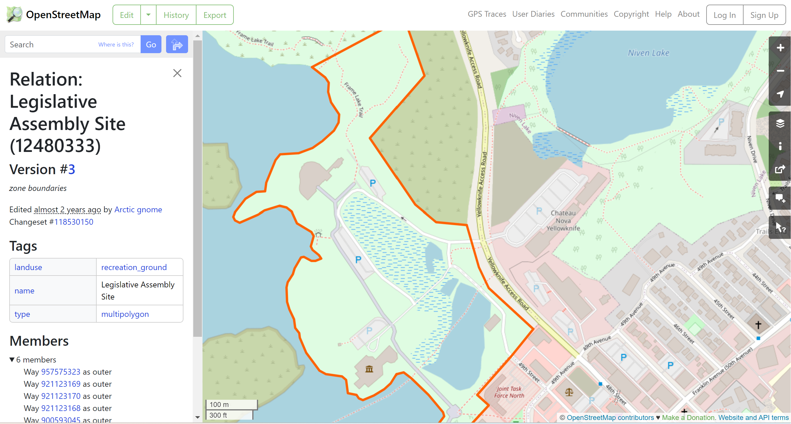
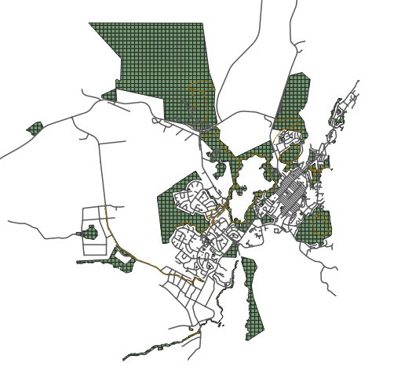
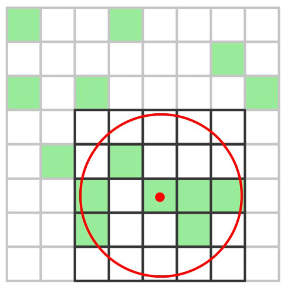

# Access to Green Space in Yellowknife
## Data Collection
**Step 1: Download data from Open Street Map (Overpass)**

From [OpenStreetMap](https://www.openstreetmap.org/relation/12480333#map=16/62.4587/-114.3753), start the process by identifying the type of landuse tagged for each patch of green space seen on the map. For example, it was discovered that some green space were tagged as recreational ground, some as woods, and as parks. This step is ralatively manual and would require one to scan through the entire city to identify all relevant types of categorization.

Fig 1: Identifying the type of landuse for each patch of green space on OpenStreetMap

Afterwards, using the tags of each kind of green space, one can download the geospatial data from [Overpass turbo](https://overpass-turbo.eu/).

**Step 2: Categorize different green spaces**

After going through the entire City of Yellowknife, the following list of 16 geography tags were identified for all green space. Afterwards, these green space tags were categorized as one of the four categories: **(1) Designated Green Space** ; **(2) Quasi Green Space**; **(3) Wild/Natural Green Space**; and **(4) Water**. 

| Tag Type  | Tag Name | Green Space Category |
| ------------- | ------------- | ------------- |
| amenity  | school  | Qusai Green Space
| boundary  | national_park  | Designated Green Space
| landuse	| recreation_ground | Designated Green Space
| landuse	| allotments | Qusai Green Space
| landuse	| grass| Wild/Natural Space
| landuse  | cemetary  | Qusai Green Space
| landuse | forest  | Wild/Natural Space
| leisure  | golf_course  | Qusai Green Space
| leisure  | park  | Designated Green Space
| leisure  | sports_centre  | Qusai Green Space
| leisure  | playground  | Designated Green Space
| leisure | pitch | Qusai Green Space
| leisure  | garden  | Designated Green Space
| natural  | wood  | Wild/Natural Space
| natural  | scrub | Wild/Natural Space
| natural | wetland | Water

Additional water layer was downloaded from the City of Yellowknife's open data repository which include lakes and rivers. 

## Data Analysis

**Step 3: Merge Vector Layers in QGIS**

Once all individual types of green space were loaded in QGIS, a merge was performed to combine the sub-types into the one of the four predined green space category. Then, a dissolve was perform to remove overlapping areas, as the same green patch could have more than one tag assigned to it. 

**Step 4: Intersect vector layers with grid**

Next, a grid of 100m X 100m was created in QGIS over the boundary of the city (including the First Nation community Ndilǫ). After that, an intersect was perform to overlay each green space category with the grid. 

Fig 2: The new layer with the designated green space intersecting with the grid.

**Step 5: Calculate the Green Space Area and Percentage of Green Space**

In QGIS, calculate the area of green space in each of the cell in the grid, and subsequently the percentage of green space in each cell of the grid. Export each vector layer of green space as GeoJson, with the project system set as ESPG 26711 (UTM zone 11N)

**Step 6: Calculate Percentage of Green Space within the 500m buffer of each Cell in the Grid** 

In Python, import GeoPandas to load the GeoJson files. Then, using the [centroid](https://geopandas.org/en/stable/docs/reference/api/geopandas.GeoSeries.centroid.html) and [buffer](https://geopandas.org/en/stable/docs/reference/api/geopandas.GeoSeries.buffer.html) funtions, create a 500m buffer around each centroid of each cell in the grid.

Next, iterate over each grid cell to calcuate the percentage of green space with which its buffer intersects. Repeat the same process for all categories of green space. Export the final table as GeoJson.

Fig 3: Illustration of the centriod and buffer for each cell in the grid

**Step 7: Load the GeoJson back to QGIS**

## Notes
Data Sources: OpenStreetMap, City of Yellowknife